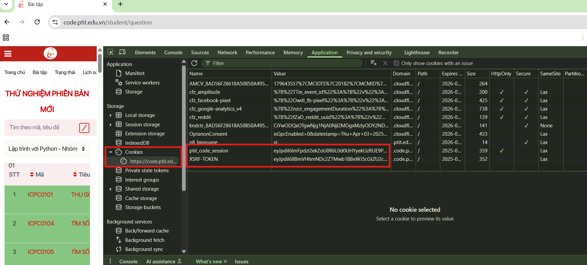
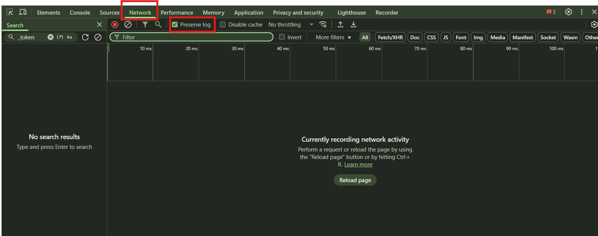
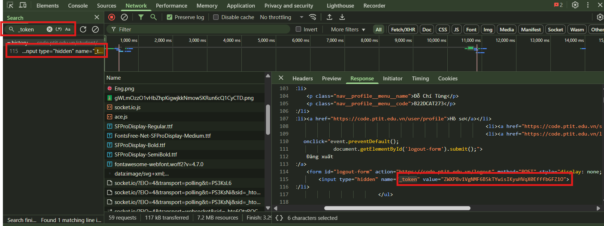
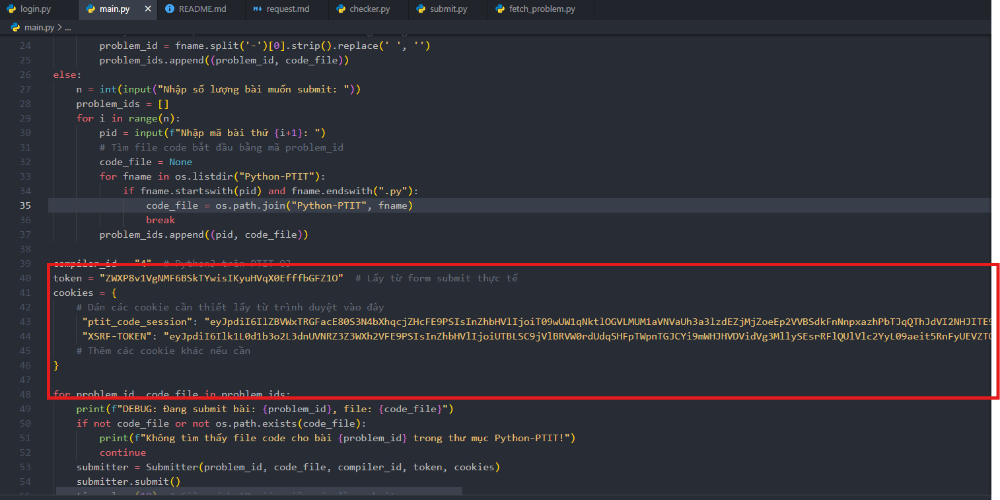

# Auto Submit Tool CodePTIT

## Mục đích
Tự động submit nhiều bài Python lên hệ thống code.ptit.edu.vn (PTIT OJ) một cách nhanh chóng và tiện lợi, anh em chỉ nên sử dụng khi đến sát deadline mà không nộp đủ số bài, tránh lạm dụng nhé XD

## Yêu cầu
- Python 3.x
- Thư viện requests (`pip install requirement`)
- Đã đăng nhập vào code.ptit.edu.vn trên trình duyệt để lấy cookie và token

## Chuẩn bị
1. **Đặt code các bài cần submit vào thư mục `Python-PTIT/`** (Ở ĐÂY MÌNH ĐỂ SẴN SRC RỒI, AE CHỈ CẦN HỮU DUYÊN LUÔN NHÉ)
2. **Lấy cookie và token:**
   - Đăng nhập code.ptit.edu.vn trên trình duyệt.
   - Mở DevTools (F12) → Application/Storage → Cookies → copy giá trị `ptit_code_session`, `XSRF-TOKEN`.
   - 

   ## BƯỚC NÀY QUAN TRỌNG NHÉ:
    1. Vào trang submit bài, sau đó bấm F12 để mở dev tool, sau đó mở tab Network, tick "Preserve log":
     
    
    2. submit 1 bài đúng, sau đó tìm `_token`, lấy giá trị `_token` trong Form Data.
   - 
    
    3. Dán các giá trị này vào biến `cookies` và `token` trong file `main.py`.
    

## Cách sử dụng
1. Mở terminal/cmd tại thư mục chứa code.
2. Chạy file main.py
3. Chọn chế độ submit:
   - **Chế độ 1:** Submit theo thứ tự file từ x đến y trong thư mục `Python-PTIT` (theo thứ tự alphabet).
     - Nhập chỉ số bắt đầu (x, bắt đầu từ 1) và chỉ số kết thúc (y).
     - Tool sẽ tự động lấy mã bài từ tên file (phần trước dấu `-`, bỏ khoảng trắng) để submit.
   - **Chế độ 2:** Nhập thủ công mã bài muốn submit.
     - Nhập số lượng bài và nhập mã bài (ví dụ: PY01001, PY01002, ...).
     - Tool sẽ tự động tìm file code tương ứng để submit.
4. Tool sẽ submit từng bài, mỗi lần cách nhau 10 giây.

## Lưu ý
- Nếu submit lỗi xác thực, hãy lấy lại cookie và token mới từ trình duyệt.
- Không cần nhập username/password khi chạy tool (chỉ cần cookie và token).
- Có thể chỉnh thời gian chờ giữa các lần submit bằng cách sửa `time.sleep(10)` trong `main.py`, anh em nào cẩn thận thì chỉnh cho giãn ra tí, tránh bị ghi log

## Liên hệ
Nếu có vấn đề hoặc cần hỗ trợ, hãy liên hệ tác giả hoặc để lại issue trên repository.
